# Potterville - Trivial Pursuit

Potterville is a brief insight into magical Harry Potter series. The quiz app is built using HTML5, CSS3, JavaScript for the Milestone 2 project of Code Institute's Full Stack Development diploma.

Live Link: https://hennasingh.github.io/Potterville/

## User Experience - UX

### Strategy

I have always been fond of Harry Potter book series. The books have a way of giving a magical pleasant feeling. I have had a Trivial Pursuit game (bought from London Airport) for a while and thought of making a more fun digital version of it.

<quote> The project has no prospective client, it is built for fun and engagement and learning purposes.</quote>

__User Stories__
- I want to be able to understand the purpose of the site.
- I want to be able to choose categories within Harry Potter series.
- I want to be able to challenge myself and time my game.
- I want to be able to see my magical quotient at the end of the game.
- I want to be able to see magical items I collected.

__User Goals__
 - Play a simple adventure game that is fun and engaging.
 - Player earns a magical item on each correct answer

 __Site Owner Goals__
 - Create a fun, interactive and engaging game.
 - Design the game to be visually appealing.
 - Add an extra challenge for Harry Potter fans aka Potterheads.
 - The site is responsive and easy to navigate.

### Scope

This took a bit of time in figuring out, it was a continuous development in this as I progressed in my javascript learning. The initial setting is to have 3 pages but this may change as I develop the working version of the website:

- Welcome Page: Introduction to Potterville and rules of the game
- Game Page: The main quiz game, that starts with category options and shows spells earned on correct answers
- End Page: Game Over Page showing magical quotient and a link to restart the game.

### Skeleton

The wireframes for mobile and desktop were created using Balsamiq. These were the original ideas but they changed as I learned and progressed in the actual development of the quiz. Some of the features will be implemented in future versions.

    
Desktop Wireframes

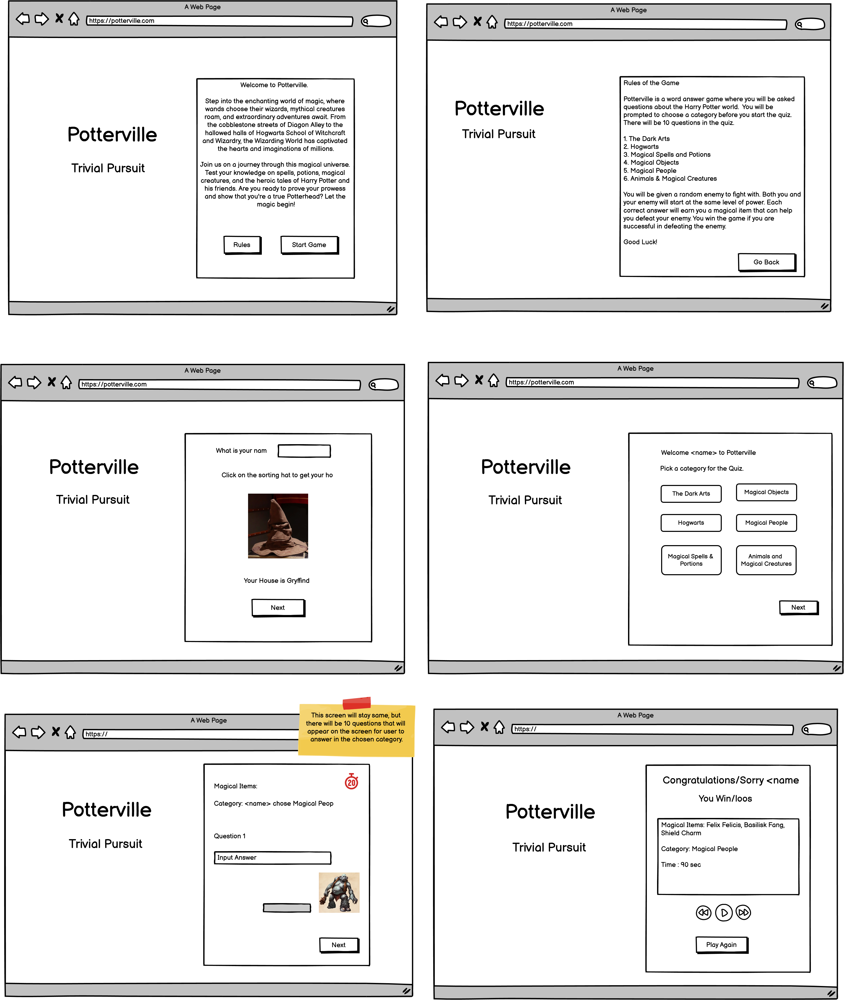

    
Phone Wireframes

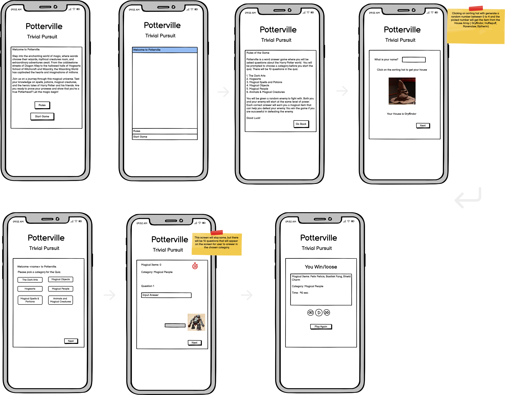

## User  Interface - Surface

### Typography

Font suggestions were taken from chatGPT. Harry Potter font was downloaded from font-space while MedievalSharp font was taken from Google Fonts.

### Colors

Color Scheme suggestions were taken from [Coolers](coolers.co) on uploading the Hogwarts background image.

Color Palette

## Site Features and Responsiveness

### Header

The site header "Potterville" along with the sub-heading "Trivial Pursuit" appears on top of all the pages and in all screen sizes

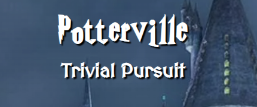

### Footer

The site footer is plain text showing the author of the website and appears on all pages in all screen sizes

### Landing/Home Page

The site landing page shows 2 accordion pannels and a button to redirect to game screen. 

Desktop View of Landing Page

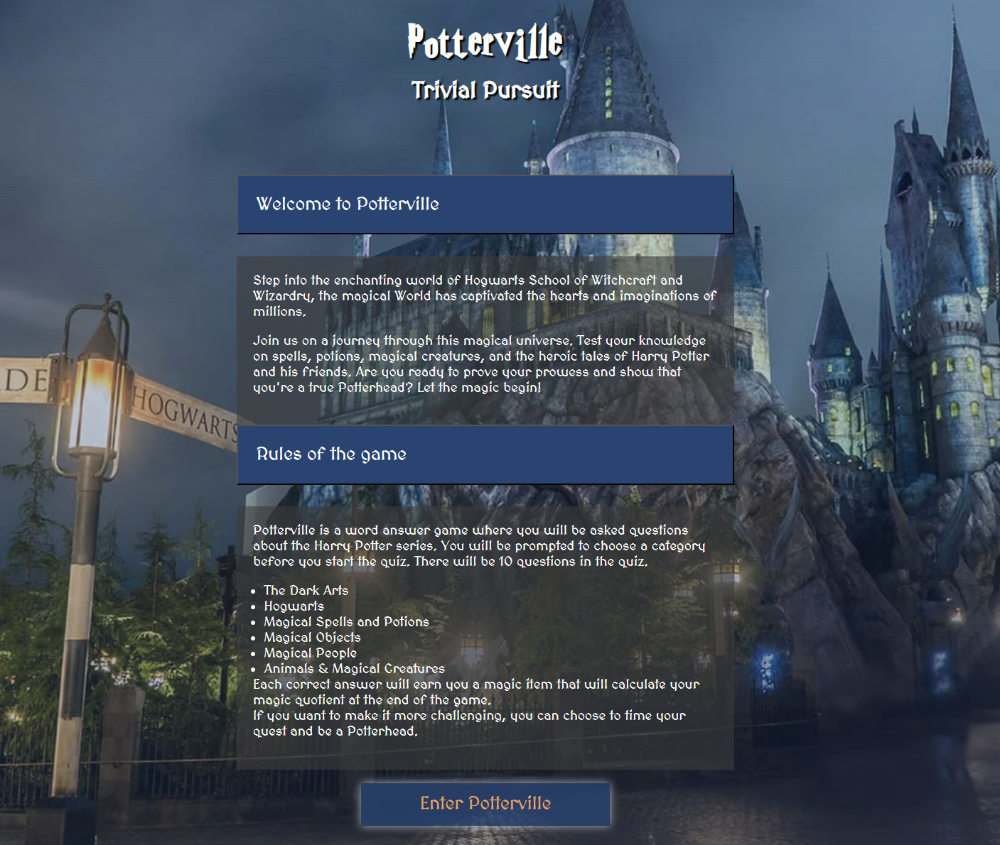

Responsive View of Landing Page

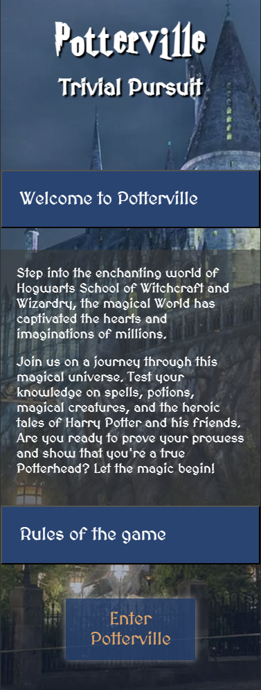

### Game/Quiz Page

The site game page hides/unhides container divs as one progresses in the game.

Choose Category Container (Desktop)

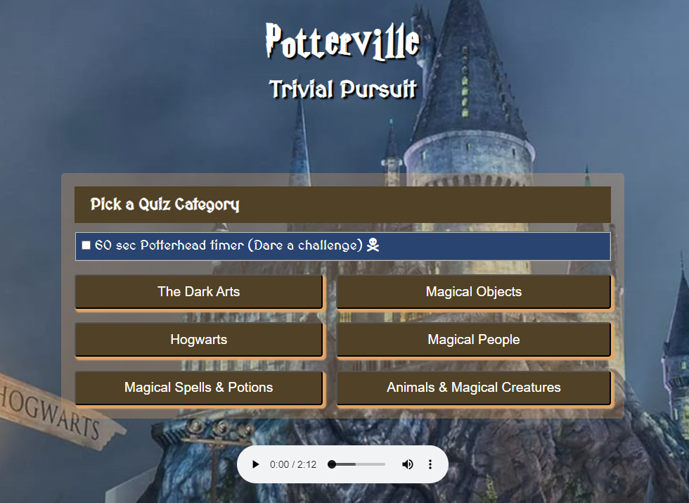

Choose Category Container (Mobile)

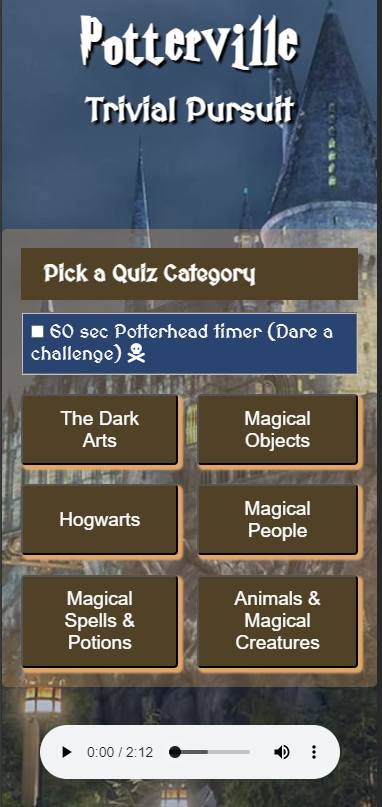

The click on the category above takes to the quiz questions in that category. If the timer is enabled, it is shown on the right. The page also has a quit button to go back to the landing page. The page offers audio to play in the background.

Game Container with Quiz questions and input answer (Desktop)

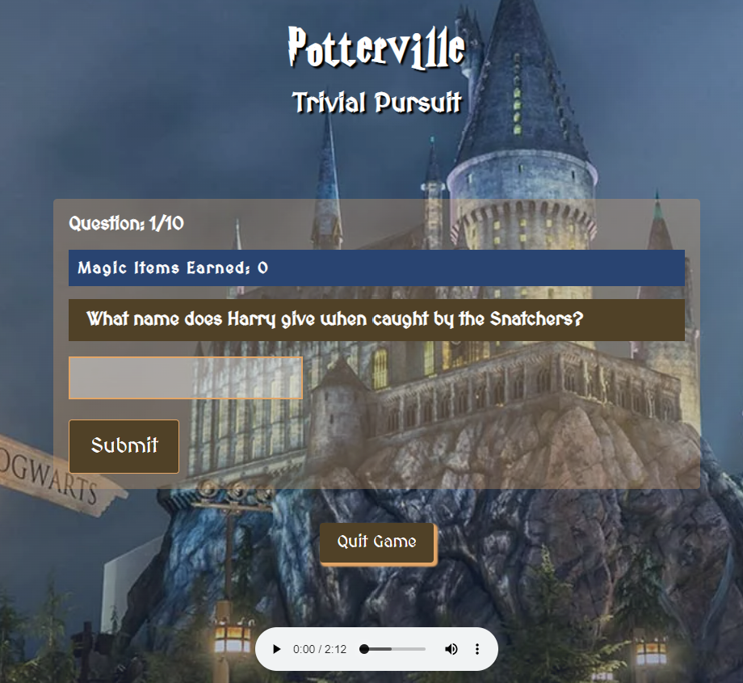

Game Container with Quiz questions and input answer (Mobile)

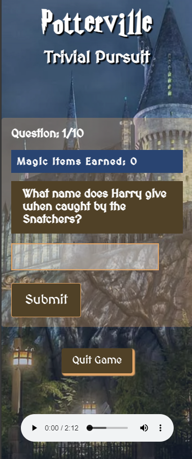

The game automatically gets over at the end of the timer and goes to the end page.

Quiz Container with the timer enabled (Dekstop)

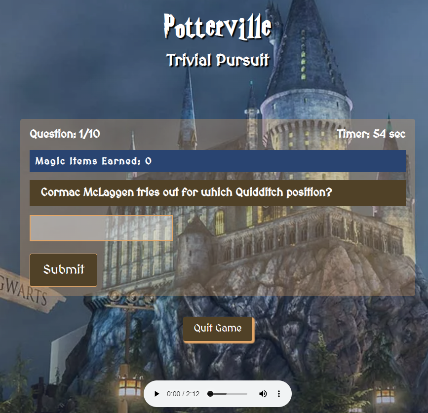

### Score Page/End Page

This page display details on the final score achieved. Magical Items are granted for every correct answer. Magic IQ is calculated based on the items collected. If timer is enabled, you are declared a Potterhead. The page displays a winning music.

Score Page (Desktop)

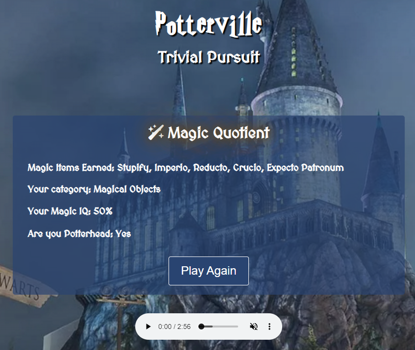

Score Page (Responsive)

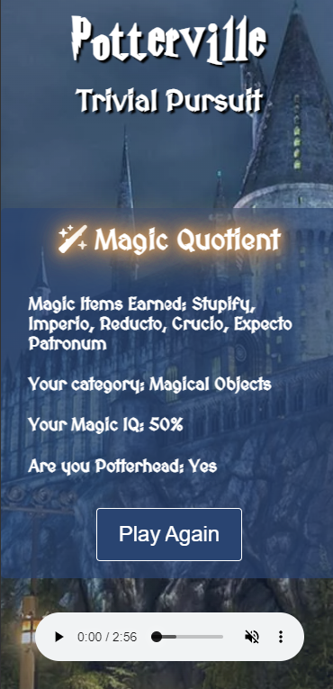

### 404 Page

This is a custom page that appears if user types incorrect url and redirects to the main page on click of the button.

404 Page

## Future Implementations

1. In the next version of the quiz, I would like to add a battleground along with answering the quiz questions. Each spell earned can be used to hit the enemy to reduce their power, as it shows in the design wireframe.

2. In the next version, the website will take user details (name) and offers to sort into house using Sorting Hat as per the design wireframe.

3. In the next version of the website, there will be a restriction to play the same category again.

4. In the next version of the website, user scores will be saved and a leaderboard will be shown.

## Accessibility

The accessibility tests are included in the testing section below. In addition to that

1. All html pages use semantic HTML headings.
2. Aria-labels are used where necessary (label, inputs)
3. legend description is used for fieldset
4. Color-contrast for foreground and background meet WCAG standard guidelines.

## Technologies Used

### Languages

- HTML5
- CSS3
- JavaScript

### Other Sites and Softwares

- Git/Github - For version control and deployment.
- [chatGPT](https://chat.openai.com/) - For content on description, and css animations.
- [cwebp](https://www.npmjs.com/package/cwebp) - For converting images from jpg/png to webp formats.
- [Balsamiq](https://balsamiq.com/) - For designing wireframes for desktop and mobile.
- [Font Awesome](https://fontawesome.com/icons) - For icons in the footer, magic wand and timer challenge.

## Testing

The testing details for the website can be found in [testing.md](testing.md)

## Deployment

### Github Pages

The website is deployed using Github Pages functionality provided by Github. The steps to follow are:

1. Create a Github account if you dont already have one
2. The repository for Potterville was created using a template provided by Code Institute. This can be found on the repository title [here](https://github.com/hennasingh/Potterville).
3. Go to settings tab on the menu bar of the repository.
4. In the left section, under Code and automation, click on Pages.
5. Under the title "Build and deployment", select the source: Deploy from a branch.
6. Under the branch section below that, select /root folder and save.
7. Come back to Code section of the repository. Give a few minutes and refresh the page. You will find Deployments section generated the right side with a URL to the deployed site.

### Local Clones

You can clone the project to deploy it locally on your own computer

1. Navigate to the project repository
2. Click on green "Code" button and local tab as shown below:

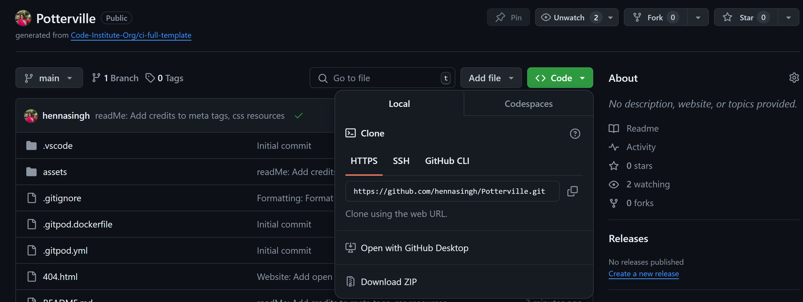

3. There are 3 methods provided to clone 'HTTPS', 'SSH',or 'Github Cli' that requires you to copy the repository link and type `git clone`in your terminal (mac) or command prompt (windows) in the chosen directory.
4. The 4th option requires you to install Github Desktop and you can open the repository in your chosen local directory.

## Credits

### Code Used

- [Accordion - W3C Schools](https://www.w3schools.com/howto/howto_js_accordion.asp) - For logic on Accordions
- [Web Dev Simplified](https://www.youtube.com/watch?v=riDzcEQbX6k) - For quiz container logic
- [Stack Overflow](https://stackoverflow.com/questions/4435776/simple-clock-that-counts-down-from-30-seconds-and-executes-a-function-afterward) - For set interval function
- [Anthony's Code](https://github.com/Ant2210/project2/blob/main/assets/js/quiz.js) - For question sorting and removal logic

### Content

- [chatGPT](https://chat.openai.com/) Used to generate landing page details
- [Hasbro Gaming](https://www.amazon.co.uk/Hasbro-Gaming-Trivial-Pursuit-Wizarding/dp/B08D2GPBFP) - For Harry Potter Trivial Pursuit questions
- Henna Singh: All other content created by the developer

### Media

- [UI.dev](https://ui.dev/amiresponsive) Used to generate the responsive image on top of the readMe file
- [Wizarding World](https://www.wizardingworld.com/features/try-out-our-new-harry-potter-video-call-backgrounds) - For Hogwarts Castle background
- [Icon Finder](https://www.iconfinder.com/) - Triwizard Cup Favicon and Sorting Hat vector
- [ClipGrab](https://clipgrab.org/faqs/howto-download-youtube-video) - used to download Harry potter music from youtube
- [You Tube](https://www.youtube.com/playlist?list=PLYXfr3Na3Iuf8Kg__C6Fll5bapkVOXp9b) - For Harry Potter Music
- [font-space](https://www.fontspace.com/category/harry-potter) - For HarryPotter font
- [Google Fonts](https://fonts.google.com/specimen/MedievalSharp) - For MedievalSharp font

## Acknowledgements

- Spencer Barriball - Mentor : For guidance and review on the website

- Kamil Wojciechowski - Cohort Facilitator : For weekly stand-up meetings and informative sessions

- Class April 2024 - For motivation, group discussions and code reviews.

