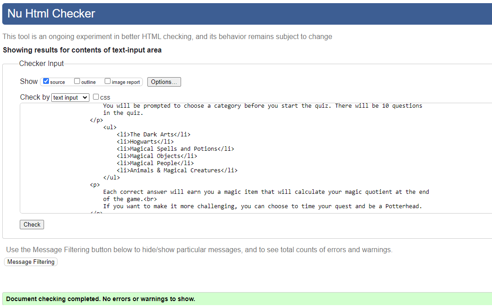
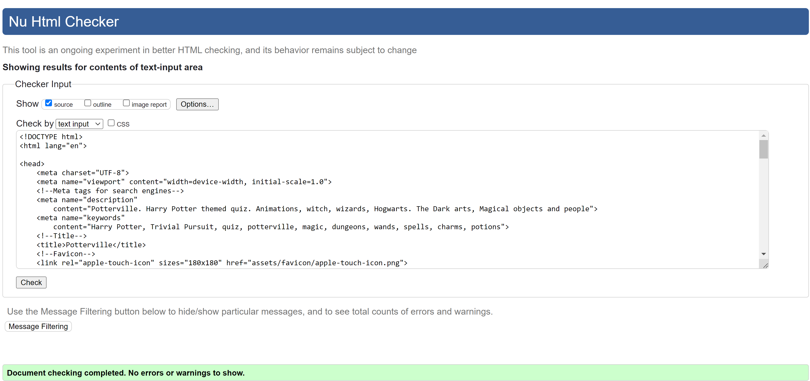
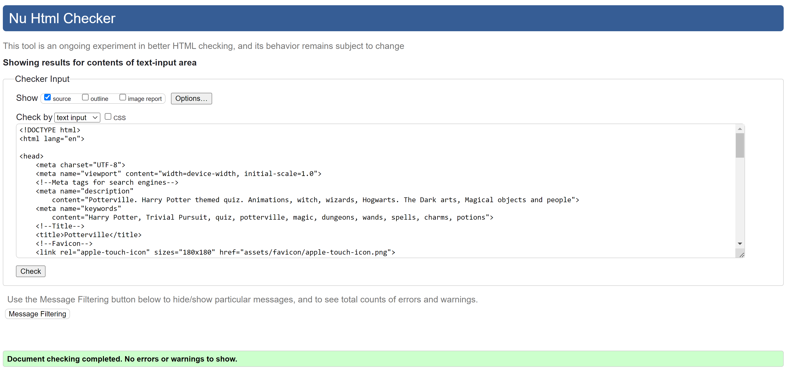
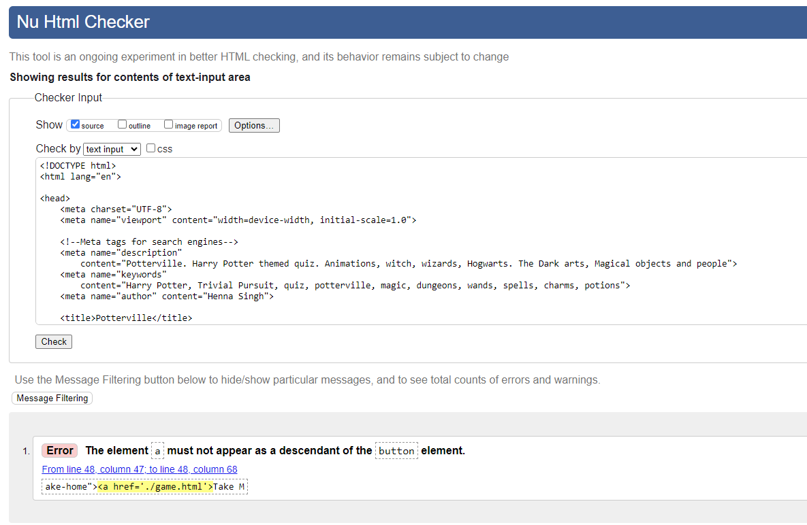
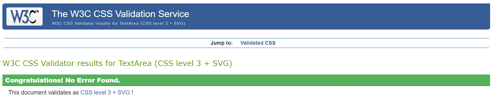
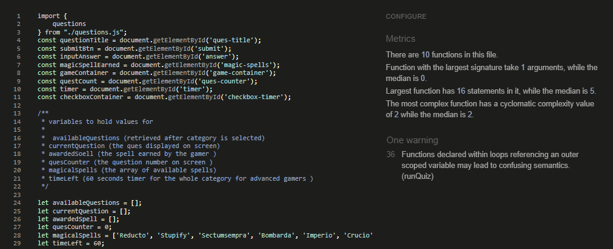
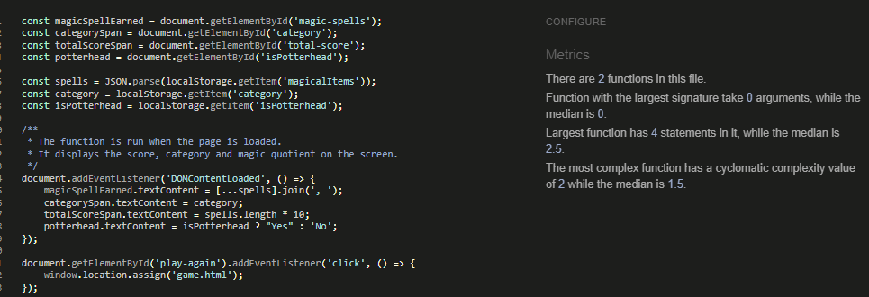

# Potterville - Testing

This page contains all the testing details the website was run through to produce performance insights.

## Automated Testing and Debugging

### W3C Validator

HTML and CSS code for the website were tested and validated by using [HTML Validator](https://validator.w3.org/#validate_by_input) and [Jigsaw CSS Validator](https://jigsaw.w3.org/css-validator/)

__HTML Validation__

1. The HTML Validation for index page showed errors on first try, those were on section without heading . That was corrected and the test passed

    
index.html

2. The HTML Validation test for Game Page, showed info messages on trailing '/' slashes on meta tags. Those were removed and the test passed

    
game.html

3. The HTML Validation for the End Page did not show any errors and passed in the first try :) 

    
end.html

4. The HTML Validation for the 404 HTML page showed an error. This was a new learning for me and I was not aware that anchor tag could not be a descendant of a button.

    
404.html page with errors

    

4.1 The 404 HTML Page was fixed by removing button and using div tag instead as a wrapper of anchor tag.

    
404.html Page without errors

__CSS Validation__

1. There was one file for CSS that passed validation in the first try

    
Styles.css

__JavaScript Validation__

The javascript validation was done using [JSHint](https://jshint.com/)

1. There were warnings on missing semicolon and they were fixed. I had to ignore the warning on function as it was designed to be that way.

game.js

2. There were semi-colon warnings for end.js as well and those were fixed.

    
end.js

