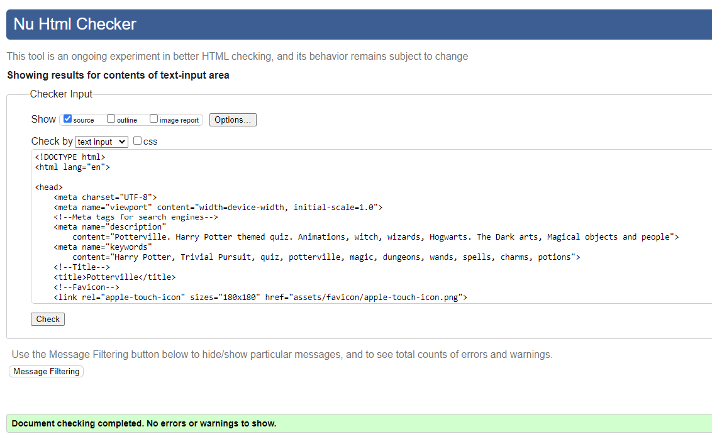
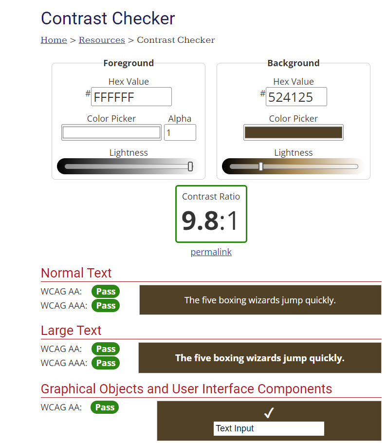

# Potterville - Testing

This page contains all the testing details the website was run through to produce performance insights.

## Automated Testing and Debugging

### W3C Validator

HTML and CSS code for the website were tested and validated by using [HTML Validator](https://validator.w3.org/#validate_by_input) and [Jigsaw CSS Validator](https://jigsaw.w3.org/css-validator/)

#### HTML Validation

1. The HTML Validation for index page showed errors on first try, those were on section without heading . That was corrected and the test passed

    
index.html

2. The HTML Validation test for Game Page, showed info messages on trailing '/' slashes on meta tags. Those were removed and the test passed

    
game.html

3. The HTML Validation for the End Page did not show any errors and passed in the first try :) 

    
end.html

4. The HTML Validation for the 404 HTML page showed an error. This was a new learning for me and I was not aware that anchor tag could not be a descendant of a button.

    
404.html page with errors

    

4. The 404 HTML Page was fixed by removing button and using div tag instead as a wrapper of anchor tag.

    
404.html Page without errors

#### CSS Validation

1. There was one file for CSS that passed validation in the first try

    
Styles.css

#### JavaScript Validation

The javascript validation was done using [JSHint](https://jshint.com/)

1. The small script to open accordion panels was added in the script tag within index.html page. It showed no errors

    
index script

2. There were warnings on missing semicolon and they were fixed. I had to ignore the warning on function as it was designed to be that way.

game.js

3. One semi colon warning on questions.js file which was fixed

    
questions.js

    

4. There were semi-colon warnings for end.js as well and those were fixed.

    
end.js

### Lighthouse Testing - Performance

#### Desktop

The lighthouse testing for desktop gave 100 results in all key areas: Performance, Accessibility, Best Practices and SEO

#### Mobile

### Accessibility Tetsing - Wave Evaluation Tool

1. The initial test reported text contrast errors on the headings and footer titles. It took a lot of hit and trial to fix this with changing text shadows, adding box shadow and finally fixing it with applying linear gradient to background image

index.html page with errors

2. The Index Html page after fixing the contrast errors

index.html page without errors

3. The game.html page had few errors that were fixed
- The fieldset had a missing legend that was added but hidden.
- There was no description to label attached to input that accepted answers, so aria-label attribute was added.
- The font-awesome icons were aria-hidden and were kept as is.
- The Alert was on HTML Audio that needed a transcript attached. I have ignored the alert for now.

game.html page with no errors

4. The end.html had one error on missing a heading level, I was missing h3 and I replaced the Magic Quotient with h3 instead of h2 and increased the font-size in the css.

end.html page with no errors

### WebAIM - Color Contrast Testing

The [webaim](https://webaim.org/resources/contrastchecker/) tool was used to verify color contrast for background and foreground

1. The white text on blue background passed the test in index.html page

Color Contrast for index.html page

2. The color contrast for orange over blue with alpha value failed for WCAG AAA rating as I was not able to add alpha to the color as tool did not have option to do. It passes AAA on large text and text is large in the code

Color Contrast for Enter Potterville

3. The color contrast for category buttons in game.html passed WCAG AA and WCAG AAA ratings

Color Contrast for Quiz Category Buttons

4. The h3 question title or pick a quiz category text failed the color contrast in the first test, so colors were change to same as to what was kept for category buttons in the above snapshot. (#524125 for background and #fff for foreground)

h3 question title on game.html page failed test

## Manual Testing

### Testing User Stories

The following user stories were considered in the UX - Strategy plane

> I want to be able to understand the purpose of the site.

The landing page introduces Potterville and defines the rules of the game

> I want to be able to choose categories within Harry Potter series.

> I want to be able to challenge myself and time my game.

The Game Page offers 6 categories to choose from and an option to time for extra challange

> I want to be able to see my magical quotient at the end of the game.

> I want to be able to see magical items I collected.

The End Page displays Spell score and magical items collected

### Testing Devices

Testing was performed on:

- Laptop
  - Lenovo Yoga 9

- Desktop Screen
  - 29 inch ViewSonic Screen

- Browsers
    - Google Chrome

### Manual Feature Tests

| Action | Expected Outcome | Result |
|--------| -----------------|--------|
| Click on Welcome to Potterville Button | Opens panel to display description | Pass |
| Click on Rules of the game | Opens panel to display rules | Pass |
| Click on either of above two buttons again | Description closes | Pass |
| Hover over thge buttons on home page | Cursor changes to pointer | Pass |
| Hover over Enter Potterville | button transforms bigger | Pass |
| Click on enter Potterville | Navigates to Game Page | Pass |
| Click on timer checkbox | Enables timer for the game | Pass |
| Click on either of 6 category buttons | Displays category on the page and quiz starts | Fail |
| Hover over any of the 6 buttons | Cursor changes to grabbing | Pass |
| Enter correct answer | background glows green | Pass |
| Enter wrong answer | background pauses  glows reddish | Pass |
| Timer runs out | Scoreboard is displayed| Pass |
| Click on audio | Sound is played | Pass |
| Press enter after typing answer in the input box | Moves to the next questions after displaying color | Pass |
| Click on Play Again button | Redirects to game page to select category | Pass |

